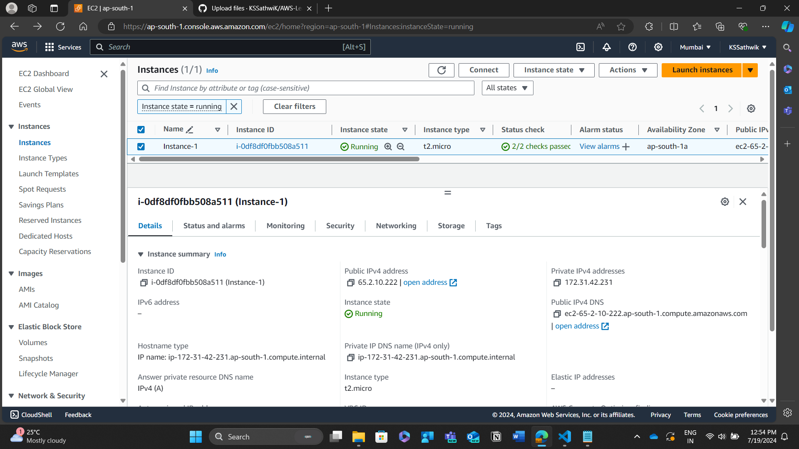

Instance name = Instance-1
AMI = Amazon Linux
Type = t2.micro
Key-pair = AWS-EPAM(Learning)
Network -> Default VPC
        -> Created A Security Group -> SSH traffic -> Anywhere(0.0.0.0/0)
Storage -> 8GB
